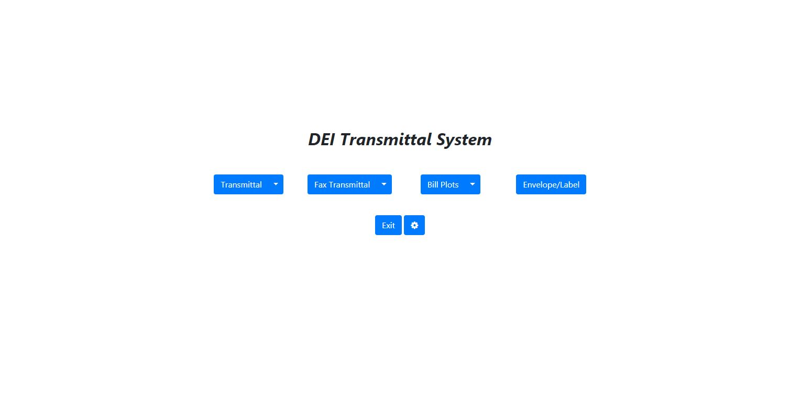
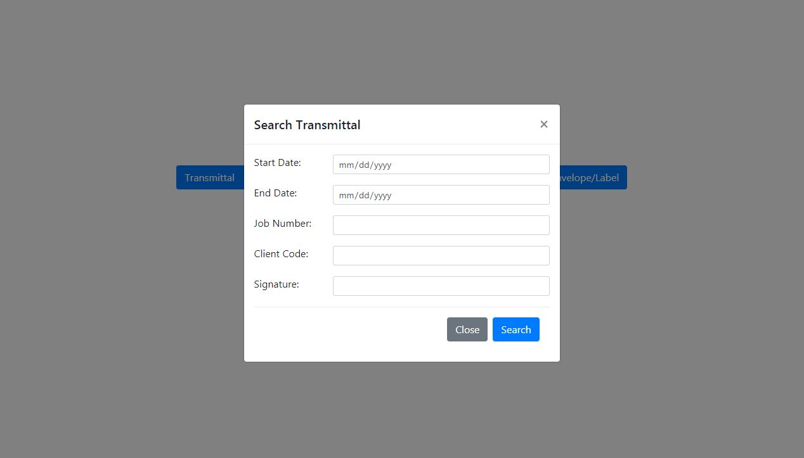
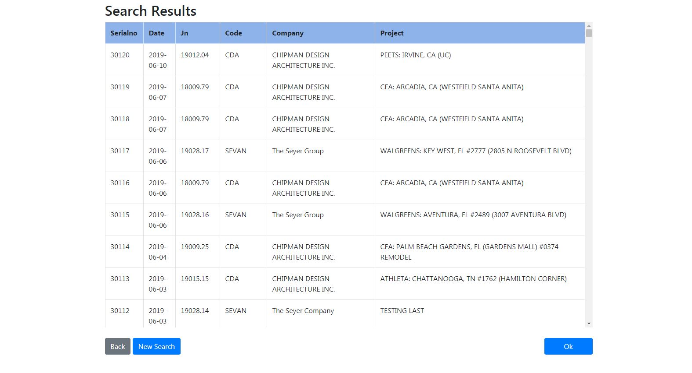
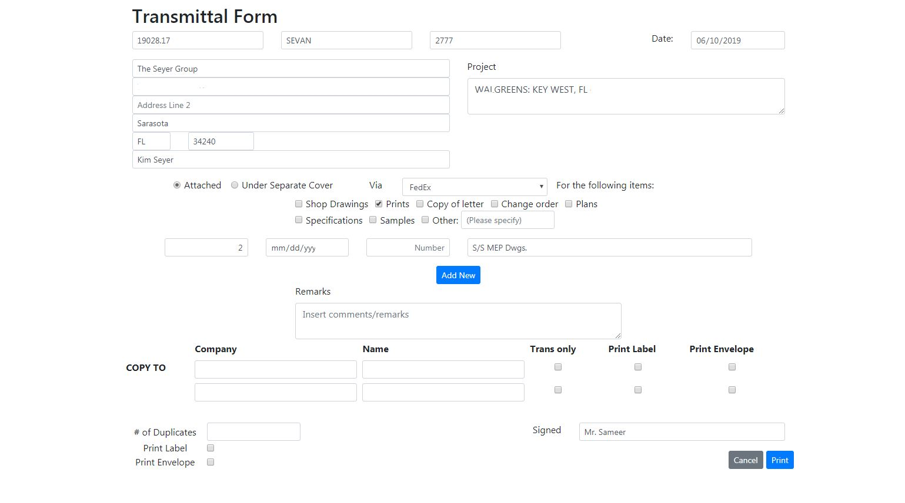
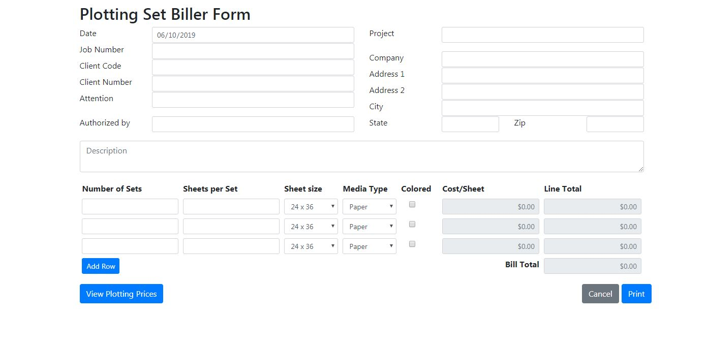
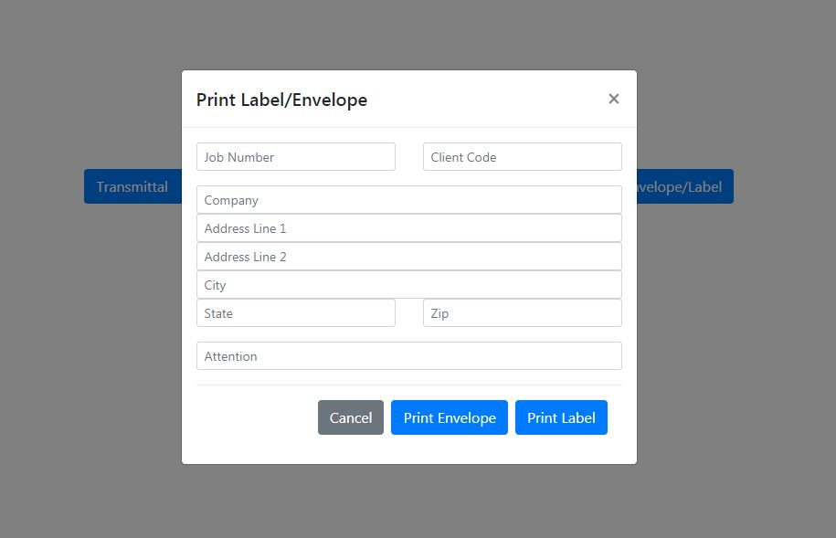

# Transmittal System
DEI Transmittal System for creating, searching, and printing transmittal documents. Includes functionality for printing DEI envelopes and mailing labels.

## Screenshots

## Functionality
- Autocompletion on address fields based on job number or client code entry
- Autocompletion for signature and attention fields based on client initials and client code
- Overrides browser print dialogue by sending PDFs directly to printer files on server
- Allows user to search for past transmittal documents and retrieve/edit information for reprinting

### Features
- PHP | Ajax requests to PHP scripts, HTML in PHP script
- MariaDB | MySQL db table usage for data storage and retrieval 
- HTTP POST and GET | Scripts use a combination of both methods for form submissions. Variables passed with GET are encrypted if it contains actual information
- TCPDF | Server-side PDF creation
- Server-side printing | Outputed documents are sent directly to office printers (to override browser print dialog)
- Bootstrap | Mostly Bootstrap styling with some CSS customization
